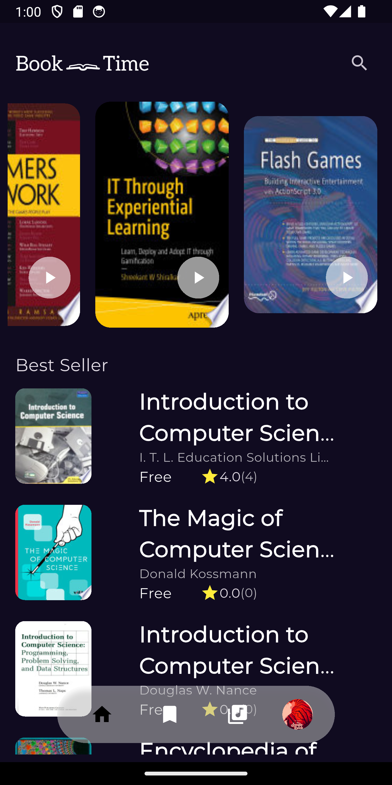
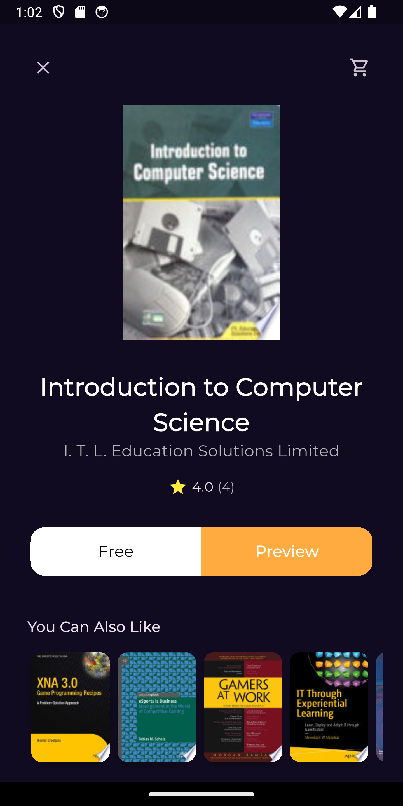

# 📚 Book App

A Flutter Book App that allows users to browse and preview books. Built with **Cubit** for state management, **GetIt** for dependency injection, and **GoRouter** for navigation, following the **MVVM architecture**.

---

## ✨ Features
- Fetches books from an API
- Click on a book to preview details
- Smooth navigation using GoRouter
- Clean and maintainable MVVM architecture

---

## 🛠️ Tech Stack
- **State Management:** Cubit
- **Dependency Injection:** GetIt
- **Navigation:** GoRouter
- **Architecture:** MVVM
- **Backend:** API Data Fetching

---

## 🎥 Demo GIF
  

---

## 📸 Screenshots
  
 

---

